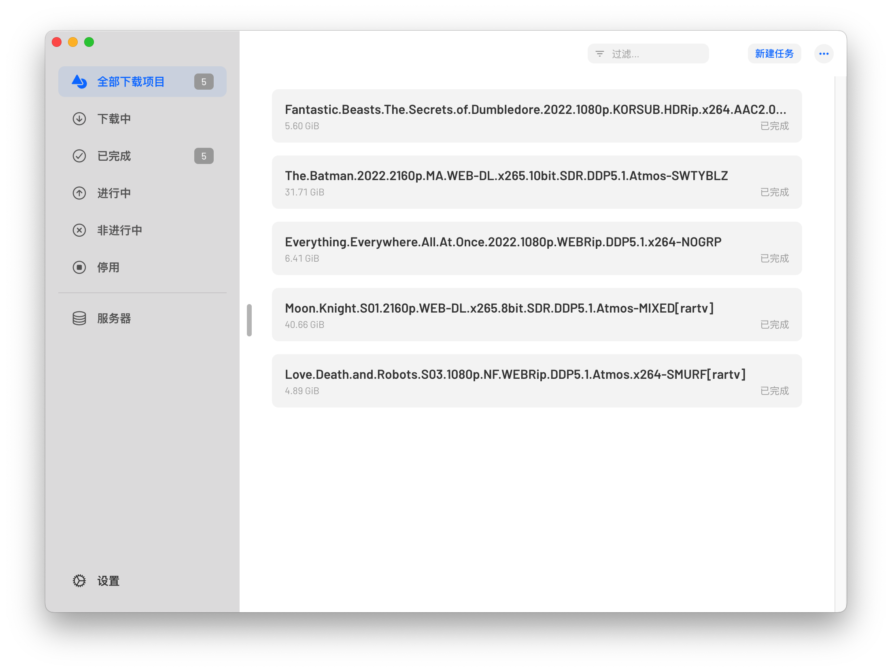

# Yadds

[](./LICENSE)
[](./package.json)
[](./package.json)
[](https://github.com/shensven/Yadds/actions/workflows/test.yml)
[](https://github.com/shensven/Yadds/actions/workflows/publish.yml)
[](https://app.codacy.com/gh/shensven/Yadds?utm_source=github.com&utm_medium=referral&utm_content=shensven/Yadds&utm_campaign=Badge_Grade_Settings)
[](https://crowdin.com/project/yadds)

⚠️ 本仓库已不再维护，目前正在使用原生语言分别为 macOS 和 Windows 开发，敬请期待！

[English](./README.md) | 简体中文

## ✨ 特性

- [x] 不但免费、还开源
- [x] 不收集用户的任何信息
- [x] 跨平台支持 （macOS、Windows、Linux）
- [x] 多语言热切换 （English、简体中文、繁體中文、日本語等）
- [x] 暗黑模式
- [ ] 支持 Touch Bar（仅部分麦金塔机型）
- [ ] 支持 [Synology Secure Signin](https://www.synology.cn/zh-cn/dsm/packages/SecureSignIn) 无密码登录
- [x] 多用户切换
- [ ] 自动接入 BitTorrent tracker 列表
- [ ] 下载进度可视化

## 🔨 编译

### 简介

- 使用 [Electron](https://www.electronjs.org/) 和 [React](https://reactjs.org/) 编写
- 使用 [Dependabot](https://github.com/features/security/software-supply-chain) 保持依赖在同一个大版本下始终最新
- 使用 [Github Actions](https://github.com/shensven/Readhubn/actions) 进行测试和持续集成

### 先决条件

- [Node 14](https://nodejs.org) 或更高版本，推荐使用 [nvm](https://github.com/nvm-sh/nvm) 或 [nvm-windows](https://github.com/coreybutler/nvm-windows) 进行安装
- [npm 8](https://www.npmjs.com/package/npm) 或更高版本

### 起步

在 `dev` 模式运行：

```bash
npm run start
```

### 打包

为当前操作系统编译安装包程序：

```bash
npm run package
```

## 👀 预览

 
 
## 👍 致谢

- [Electron React Boilerplate - A Foundation for Scalable Cross-Platform Apps](https://github.com/electron-react-boilerplate/electron-react-boilerplate)
- [3dicons - Open source 3D icon library](https://3dicons.co/)

## 📜 许可证合规性

[](https://app.fossa.com/projects/git%2Bgithub.com%2Fshensven%2FYadds?ref=badge_large)
