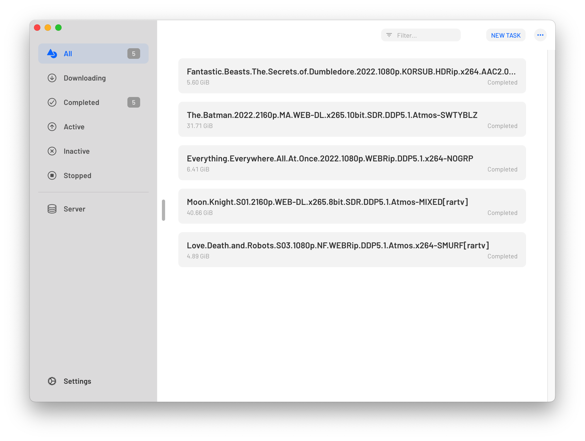

# Yadds

[](./LICENSE)
[](./package.json)
[](./package.json)
[](https://github.com/shensven/Yadds/actions/workflows/test.yml)
[](https://github.com/shensven/Yadds/actions/workflows/publish.yml)
[](https://app.codacy.com/gh/shensven/Yadds?utm_source=github.com&utm_medium=referral&utm_content=shensven/Yadds&utm_campaign=Badge_Grade_Settings)
[](https://crowdin.com/project/yadds)

⚠️ This repository is no longer maintained and is currently being developed in native languages for macOS and Windows respectively, so stay tuned!

English | [简体中文](./README-zh-hans.md)

## ✨ FEATURES

- [x] NOT only free also open source
- [x] Does NOT collect any information from users
- [x] Cross-platform support (macOS, Windows, Linux)
- [x] Multi-language hot-switching (English, 简体中文, 繁體中文, 日本語 and etc.)
- [x] Dark mode
- [ ] Support Touch Bar (Mac only if available)
- [ ] Support for [Synology Secure Signin](https://www.synology.com/en-us/dsm/packages/SecureSignIn) passwordless login
- [x] Multi-account switching
- [ ] Automatic access to BitTorrent tracker list
- [ ] Download progress visualization

## 🔨 BUILD

### INTRO

- Written with [Electron](https://www.electronjs.org/) & [React](https://reactjs.org/)
- To keep dependencies up to date under the same major version via [Dependabot](https://github.com/features/security/software-supply-chain)
- Testing and continuous integration via [Github Actions](https://github.com/shensven/Readhubn/actions)

### PREREQUISITES

- [Node 14](https://nodejs.org) or higher, [nvm](https://github.com/nvm-sh/nvm) or [nvm-windows](https://github.com/coreybutler/nvm-windows) is recommended for installation
- [npm 8](https://www.npmjs.com/package/npm) or higher

### STARTING DEVELOPMENT

Start the app in the `dev` mode:

```bash
npm run start
```

### PACKAGING FOR PRODUCTION

To package apps for the local platform:

```bash
npm run package
```

## 👀 PREVIEW

 

## 👍 CREDITS

- [Electron React Boilerplate - A Foundation for Scalable Cross-Platform Apps](https://github.com/electron-react-boilerplate/electron-react-boilerplate)
- [3dicons - Open source 3D icon library](https://3dicons.co/)

## 📜 LICENSE

[](https://app.fossa.com/projects/git%2Bgithub.com%2Fshensven%2FYadds?ref=badge_large)
